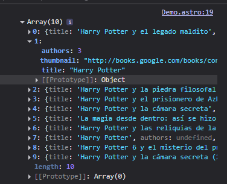

# REST API

## Description

This is a simple implementation of Google Books API 

## Details

- **API:** GET books, title, image, description and other items

## Capturas de Pantalla

## 🛠️ Stack

- [**Astro**](https://astro.build/) - The web framework for content-driven websites.
- [**Typescript**](https://www.typescriptlang.org/) - JavaScript with syntax for types.
- [**Tailwind CSS**](https://tailwindcss.com/) - A utility-first CSS framework for rapidly building custom designs.

## 🧞 Commands

All commands are run from the root of the project, from a terminal:

| Command                   | Action                                           |
| :------------------------ | :----------------------------------------------- |
| `npm install`             | Installs dependencies                            |
| `npm run dev`             | Starts local dev server at `localhost:4321`      |
| `npm run build`           | Build your production site to `./dist/`          |
| `npm run preview`         | Preview your build locally, before deploying     |
| `npm run astro ...`       | Run CLI commands like `astro add`, `astro check` |
| `npm run astro -- --help` | Get help using the Astro CLI                     |

